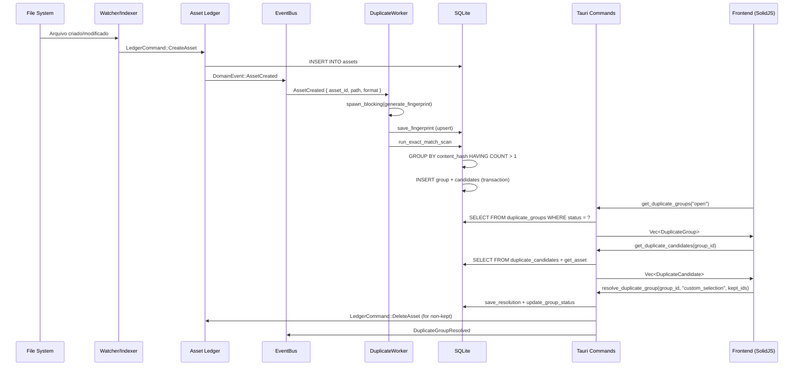

# Relatório Completo — Módulo de Detecção de Arquivos Duplicados

**Projeto:** Mundam — Digital Asset Manager  
**Data:** 2026-08-31  
**Autor:** Gerado automaticamente a partir da análise de código  
**Referências:** `gpt-overview.md`, `gpt-proprosal.md`, `implementation-plan.md`

---

## 1. Visão Geral

O módulo de detecção de duplicados foi implementado como um subsistema completo do Mundam, seguindo a filosofia de **processamento incremental em background** integrado ao pipeline de indexação existente. A arquitetura segue o padrão Hexagonal (Ports & Adapters) já utilizado no restante do projeto, com separação clara entre domínio (`core/`), orquestração (`feature/`), infraestrutura (`infra/`) e entrega (`delivery/`).

### 1.1 Status Atual

| Componente                     | Status     | Observações                                                |
| ------------------------------ | ---------- | ---------------------------------------------------------- |
| Modelo de Domínio (Rust)       | ✅ Completo | 6 entidades, 3 enums                                       |
| Tabelas SQLite                 | ✅ Completo | 5 tabelas + 4 índices                                      |
| Repositório (Porta)            | ✅ Completo | Trait com 8 operações                                      |
| Repositório (SQLite)           | ✅ Completo | Implementação com upserts                                  |
| DuplicateWorker (Eventos)      | ✅ Completo | Escuta `AssetCreated` (hashing) e `AssetDeleted` (cleanup) |
| DuplicateCommandService        | ✅ Completo | Resolve, ignora, deleta via Ledger e gerencia lixeira      |
| DuplicateQueryService          | ✅ Completo | Consulta por status e candidatos                           |
| Tauri Commands                 | ✅ Completo | 4 comandos expostos                                        |
| Domain Events                  | ✅ Completo | 5 variantes de evento                                      |
| Frontend — View                | ✅ Completo | `DuplicateFinderView` com ResizablePanel                   |
| Frontend — Group List          | ✅ Completo | Componente extraído com deck preview                       |
| Frontend — Group Item          | ✅ Completo | Deck visual + ignored styling                              |
| Frontend — Comparison Panel    | ✅ Completo | Cards lado a lado, smart actions e visual de lixeira       |
| Frontend — Hook                | ✅ Completo | `useDuplicateGroups` com fetch + mutate                    |
| Frontend — Types/API           | ✅ Completo | `duplicates.ts` com mapeamento completo                    |
| Hashing Real (Blake3)          | ✅ Completo | Streaming hashing implementado (`generate_fingerprint`)    |
| Perceptual Hash                | ✅ Completo | dHash 8x8 implementado em `generate_fingerprint`           |
| UI de Regras Configuráveis     | ❌ Pendente | Modelo pronto, UI não criada                               |
| Comparação Visual (Split View) | ✅ Completo | Modal com ResizablePanels e protocolo `asset://`           |

---

## 2. Arquitetura Backend (Rust)

### 2.1 Modelo de Domínio — `core/models/duplicates.rs`

O módulo define 6 structs e 3 enums que representam completamente o domínio de duplicados:

```
DuplicateFingerprint     → Impressão digital de um asset (hashes, dimensões, mime)
DuplicateGroup           → Agrupamento de candidatos similares
DuplicateCandidate       → Um asset membro de um grupo
DuplicateResolution      → Registro da decisão do usuário
DuplicateRuleSet         → Perfil de regras de detecção configurável
DuplicateGroupType       → enum: Exact | Near | Derived
DuplicateGroupStatus     → enum: Open | Reviewed | Ignored | Resolved
DuplicateResolutionAction→ enum: KeepOne | DeleteSelected | MergeMetadata | IgnoreGroup | CustomSelection
```

Todos os enums usam `strum::Display` e `strum::EnumString` para serialização segura de/para strings no SQLite, eliminando conversões manuais propensas a erro.

### 2.2 Porta do Repositório — `core/repository/duplicates.rs`

Define o trait `DuplicatesRepository` com 15 operações assíncronas:

| Método                         | Tipo  | Descrição                                          |
| ------------------------------ | ----- | -------------------------------------------------- |
| `save_fingerprint`             | Write | Upsert de fingerprint (ON CONFLICT UPDATE)         |
| `get_fingerprint`              | Read  | Busca por `asset_id`                               |
| `get_rule_sets`                | Read  | Lista todas as regras configuradas                 |
| `save_group`                   | Write | Cria ou atualiza grupo (upsert)                    |
| `save_candidate`               | Write | Adiciona candidato ao grupo (upsert)               |
| `get_groups_by_status`         | Read  | Filtra grupos por status (`open`, `ignored`, etc.) |
| `get_group_candidates`         | Read  | Lista candidatos de um grupo                       |
| `save_resolution`              | Write | Registra decisão do usuário                        |
| `update_group_status`          | Write | Altera status do grupo                             |
| `run_exact_match_scan`         | Write | Varredura completa por hash exato (Blake3)         |
| `run_visual_match_scan`        | Write | Varredura por hash perceptual (dHash)              |
| `rehash_pending_fingerprints`  | Write | Rehash de fingerprints `pending_` em lote          |
| `delete_fingerprint`           | Write | Remove o fingerprint de um asset deletado          |
| `remove_candidate_from_groups` | Write | Remove candidato de grupos; auto-resolve se < 2    |

### 2.3 Implementação SQLite — `infra/sqlite/duplicates_repository.rs`

A implementação concreta usa `sqlx::Pool<Sqlite>` e segue padrões consistentes:

- **Upserts** via `INSERT ... ON CONFLICT DO UPDATE` para fingerprints, grupos e candidatos.
- **Transações** (`pool.begin()` + `tx.commit()`) no `run_exact_match_scan` para garantir atomicidade ao criar grupo + candidatos.
- **Backfill automático**: Ao rodar o scan, gera fingerprints para assets que existiam antes do módulo ser implementado:

```sql
INSERT OR IGNORE INTO duplicate_fingerprints (asset_id, content_hash, file_size, ...)
SELECT a.id, 'hash_' || CAST(a.file_size as TEXT), a.file_size, ...
FROM assets a
WHERE NOT EXISTS (SELECT 1 FROM duplicate_fingerprints df WHERE df.asset_id = a.id)
```

- **Seed automático** do rule set `exact-match` via `INSERT OR IGNORE` para evitar FK constraint errors.

### 2.4 Camada Feature — `feature/duplicates/`

#### `commands.rs` — DuplicateCommandService

Orquestra a resolução de grupos com integração ao **Asset Ledger**:

1. Recebe a ação do usuário (`IgnoreGroup`, `CustomSelection`, etc.)
2. Persiste a `DuplicateResolution` com audit trail completo (who, when, payload)
3. Atualiza o status do grupo (`ignored` ou `resolved`)
4. Para `CustomSelection`: itera candidatos e envia `LedgerCommand::DeleteAsset` para cada asset não-selecionado
5. Publica `DomainEvent::DuplicateGroupResolved`

#### `queries.rs` — DuplicateQueryService

Camada fina que delega ao repositório para consultas de leitura.

#### `events.rs` — DuplicateWorker

Worker em background que escuta o `AppEventBus`:

1. Recebe `DomainEvent::AssetCreated`
2. Executa `generate_fingerprint` usando hash Blake3 via `tokio::task::spawn_blocking`
3. Salva o fingerprint no repositório
4. Recebe `DomainEvent::AssetDeleted`
5. Limpa candidates órfãos, ajusta contagem do grupo e auto-resolve grupos com `< 2` candidatos.
6. Roda `run_exact_match_scan` automaticamente após cada novo fingerprint ou scan manual.

**Estado atual do hashing**: O `generate_fingerprint` usa **Blake3** para calcular hashes perfeitos via streaming. Para assets importados via BatchCreate, há um mecanismo de backfill (`pending_`) que processa tudo de forma assíncrona na próxima varredura, garantindo a performance da galeria. Os campos `perceptual_hash` e `block_hash` ficam como `None` temporariamente.

### 2.5 Delivery Tauri — `delivery/tauri/commands/duplicates.rs`

4 comandos registrados no `invoke_handler`:

| Comando                    | Parâmetros                          | Retorno                   |
| -------------------------- | ----------------------------------- | ------------------------- |
| `get_duplicate_groups`     | `status: String`                    | `Vec<DuplicateGroup>`     |
| `get_duplicate_candidates` | `group_id: String`                  | `Vec<DuplicateCandidate>` |
| `resolve_duplicate_group`  | `group_id, action, kept_asset_ids?` | `()`                      |
| `start_duplicate_scan`     | —                                   | `()`                      |

### 2.6 Domain Events — `core/events/payloads.rs`

5 variantes de evento para duplicados:

```rust
DuplicateGroupCreated   { group_id, group_type, confidence, canonical_asset_id, candidate_count, rule_set_id }
DuplicateGroupUpdated   { group_id, status, candidate_count }
DuplicateGroupResolved  { group_id, action }
DuplicateScanProgressed { processed, matched, groups_created }
DuplicateScanFinished   { groups_created }
```

### 2.7 Banco de Dados — Schema

5 tabelas criadas em `bootstrap/database.rs`:

```sql
duplicate_fingerprints  — PK: asset_id, FK → assets(id) ON DELETE CASCADE
duplicate_rule_sets     — PK: id
duplicate_groups        — PK: id, FK → duplicate_rule_sets(id)
duplicate_candidates    — PK: (group_id, asset_id), FKs → groups, assets
duplicate_resolutions   — PK: id, FK → duplicate_groups(id) ON DELETE CASCADE
```

4 índices para performance:
```sql
idx_duplicate_fingerprints_content_hash
idx_duplicate_fingerprints_phash
idx_duplicate_groups_status
idx_duplicate_candidates_asset_id
```

---

## 3. Arquitetura Frontend (SolidJS)

### 3.1 Estrutura de Arquivos

```
src/components/features/duplicates/
├── index.ts                        # Barrel exports com JSDoc de módulo
├── types.ts                        # DuplicateCandidate, DuplicateGroup
├── mockData.ts                     # Dados mock para desenvolvimento (não exportado no barrel)
├── DuplicateGroupList.tsx          # Lista de grupos (sidebar)
├── DuplicateGroupItem.tsx          # Item individual com deck preview
├── DuplicateComparisonPanel.tsx    # Painel de comparação detalhada
├── DuplicateCandidateCard.tsx      # Card individual de candidato
├── DuplicateSplitView.tsx          # Modal de comparação lado a lado
├── duplicate-group-list.css
├── duplicate-group-item.css
├── duplicate-comparison-panel.css
├── duplicate-split-view.css
└── hooks/
    └── useDuplicateGroups.ts       # Hook principal de estado

src/views/
├── DuplicateFinderView.tsx         # View principal
└── duplicate-finder-view.css

src/lib/
└── duplicates.ts                   # API layer (Tauri invoke wrappers)
```

### 3.2 Hook Principal — `useDuplicateGroups`

O hook gerencia todo o estado reativo:

- **`groups`**: `createResource` que busca tanto grupos `open` quanto `ignored`.
- **`visibleGroups`**: `createMemo` derivado que filtra conforme `showIgnored`.
- **`selectGroup`**: Seleciona um grupo e carrega os candidatos sob demanda (lazy loading).
- **`resolveGroup`**: Chama a API e atualiza o estado local (move para `ignored` ou remove).
- **`startScan`**: Dispara varredura e refaz o fetch.
- **`candidatesLoaded`**: Flag booleana para distinguir "ainda não carregou" de "carregou e está vazio".

### 3.3 API Layer — `duplicates.ts`

Camada de mapeamento entre o backend Rust e os tipos do frontend:

- `BackendDuplicateGroup` → `DuplicateGroup` (converte `group_type` → `type`, `candidate_count` → `candidateCount`, `status`)
- `BackendDuplicateCandidate` + `BackendAsset` → `DuplicateCandidate` (resolve asset via `get_asset`, extrai nome do path, formata tamanho em MB, mapeia `thumbnail_path`, `state`)

### 3.4 Componentes Visuais

#### `DuplicateFinderView`
Layout principal com `ResizablePanelGroup` horizontal:
- **Painel esquerdo (30%)**: Toolbar com "Scan Now" + lista de grupos
- **Painel direito (70%)**: Painel de comparação ou mensagem contextual

#### `DuplicateGroupList`
Header com título + filtro dropdown ("Show ignored groups"). Delega renderização de cada item para `DuplicateGroupItem`.

#### `DuplicateGroupItem`
- **Deck preview**: Até 3 thumbnails empilhadas com rotação (inspirado no `MultiInspector`)
- **Badge de contagem**: Número de candidatos sobreposto no deck
- **Estado ignored**: Opacidade reduzida + grayscale + badge "Ignored"
- **Badges**: Tipo do grupo (`exact`, `visual`, `derived`) + contagem de arquivos

#### `DuplicateComparisonPanel`
- **Header**: Título, badge de tipo, confiança, botões "Ignore Group" e "Keep Selected"
- **Grid horizontal**: Cards de candidatos lado a lado com `flex-wrap: nowrap` e `overflow-x: auto`
- **Cada card**: Nome, thumbnail (com `state` para fallback correto), detalhes (path, format, size, dimensions, datas, tags, notes), botão de seleção.
- **Visual da Lixeira**: Assets apagados (`deleted_at`) ganham styling especial (grayscale, opacidade reduzida, strikethrough, ícone de lixeira, botões bloqueados).
- **Ações Inteligentes (Smart Actions)**: Funções "Manter o maior" e "Manter o mais antigo" analisam as métricas ignorando itens na lixeira, pré-selecionando os assets ideais para o usuário.
- **Seleção**: Clique no card para selecionar/deselecionar, ícone check visual.

---

## 4. Fluxo de Dados Completo



---

## 5. Bugs Resolvidos Durante a Implementação

| #   | Bug                                          | Causa Raiz                                   | Correção                                            |
| --- | -------------------------------------------- | -------------------------------------------- | --------------------------------------------------- |
| 1   | `start_duplicate_scan not allowed`           | Comandos não registrados no `invoke_handler` | Adicionados ao bootstrap                            |
| 2   | `get_asset missing required key id`          | Frontend passava `assetId` em vez de `id`    | Corrigido mapeamento em `duplicates.ts`             |
| 3   | FK constraint error 787 ao criar grupo       | `rule_set_id` referenciava tabela vazia      | Auto-seed do rule set `exact-match`                 |
| 4   | Assets existentes não apareciam no scan      | Só assets novos geravam fingerprints         | Backfill query no `run_exact_match_scan`            |
| 5   | Badge "0 files" em todos os grupos           | `candidateCount` não mapeado                 | Mapeado `candidate_count` → `candidateCount`        |
| 6   | "No candidates loaded" permanente            | Verificava `candidates.length === 0`         | Adicionado flag `candidatesLoaded`                  |
| 7   | Tamanho sempre "Unknown"                     | Frontend lia `file_size` (Rust usa `size`)   | Corrigido para ler `size` (via `#[serde(rename)]`)  |
| 8   | Thumbnails de vídeo/áudio com spinner eterno | Faltava `state` no componente Thumbnail      | Passado `state` do asset para o fallback `FileIcon` |
| 9   | Cards sobrepostos com 3+ candidatos          | CSS grid com `auto-fit` quebrando layout     | Mudado para flexbox horizontal                      |
| 10  | Conteúdo cortado verticalmente               | `align-items: stretch` no flex container     | Mudado para `align-items: start`                    |
| 11  | Filtro "Show ignored" não funcionava         | Hook só buscava grupos `open`                | Hook busca `open` + `ignored`, filtra localmente    |
| 12  | `thumbnailUrl` apontava para `id`            | Mapeamento incorreto                         | Corrigido para usar `thumbnail_path`                |

---

## 6. Análise de Gaps — O Que Falta para o Estado da Arte

### 6.1 Hashing e Fingerprinting (Crítico)

**Estado atual**: O `content_hash` é apenas `hash_{file_size}`, o que agrupa erroneamente arquivos de tamanhos iguais mas conteúdos diferentes.

**Necessário para estado da arte**:

| Prioridade | Item                           | Impacto                                    | Complexidade |
| ---------- | ------------------------------ | ------------------------------------------ | ------------ |
| **P0**     | Hash real com Blake3 ou xxHash | ✅ Implementado na Fase 1                   | Resolvido    |
| **P1**     | Perceptual Hash (pHash/dHash)  | ✅ Implementado na Fase 2                   | Resolvido    |
| **P2**     | Block Hash multi-escala        | Detecta crops e edições parciais           | Alta         |
| **P3**     | Thumbnail Hash                 | Checagem rápida baseada em thumb existente | Baixa        |

**Recomendação técnica**: Usar a crate `blake3` para hash de conteúdo (streaming, sem carregar arquivo inteiro na memória) e `image` + implementação manual de dHash 8x8 para perceptual hash. Para block hash, avaliar `img_hash` crate.

### 6.2 Performance e Escalabilidade

| Item                        | Estado Atual                                | Ideal                                     |
| --------------------------- | ------------------------------------------- | ----------------------------------------- |
| Scan incremental            | ✅ Implementado na Fase 3                   | Scan apenas de novos fingerprints         |
| Batch loading de candidatos | ❌ N+1 queries (1 `get_asset` por candidato) | `SELECT ... WHERE id IN (...)` batch      |
| Cancelamento de scan        | ✅ Implementado na Fase 3                   | `CancellationToken` para abort            |
| Progresso de scan           | ✅ Implementado na Fase 3                   | Emissão real de `DuplicateScanProgressed` |
| Indexação paralela          | ❌ Sequencial (1 fingerprint por vez)        | Work-stealing pool com `rayon`            |
| Paginação de grupos         | ❌ Carrega todos de uma vez                  | `LIMIT/OFFSET` ou cursor-based            |
| Cache de thumbnails no deck | ❌ Cada deck item faz request                | Pré-carregar thumbnails com o grupo       |

### 6.3 Interface de Usuário

| Item                            | Estado Atual        | Ideal (Estado da Arte)                        |
| ------------------------------- | ------------------- | --------------------------------------------- |
| Split View sincronizado         | ✅ Implementado (Fase 2)| Zoom/Pan travado entre 2 imagens              |
| Overlay de diferenças           | ❌ Não implementado  | Toggle de transparência entre versões         |
| Ações em lote (bulk)            | ❌ Um grupo por vez  | Selecionar múltiplos grupos e resolver        |
| "Manter o maior/mais antigo"    | ✅ Implementado      | Filtra assets na lixeira no agrupamento       |
| Visual da Lixeira (MoveToTrash) | ✅ Implementado      | Card com strikethrough e sem ações bloqueadas |
| Merge de metadados/tags         | ✅ Implementado (Fase 3)| Transferir tags ao manter um asset            |
| Resumo/Dashboard                | ❌ Não há            | Contadores, gráficos de economia              |
| Atalhos de teclado              | ✅ Implementado (Fase 2)| ← → para navegar, K para keep, D para delete  |
| Filtros avançados               | ❌ Apenas por status | Por tipo, confidence, pasta, formato          |
| Notificação de novos duplicados | ✅ Implementado (Fase 3)| Toast/badge quando worker encontra grupo      |

### 6.4 Regras Configuráveis

| Item                           | Estado Atual               | Ideal                                    |
| ------------------------------ | -------------------------- | ---------------------------------------- |
| Modelo `DuplicateRuleSet`      | ✅ Pronto no banco          | —                                        |
| UI de criação/edição de regras | ❌ Não implementado         | `DuplicateRulesDialog` com toggles       |
| Aplicação de regra no scan     | ❌ Sempre usa `exact-match` | Seletor de perfil antes do scan          |
| Perfis pré-definidos           | ❌ Apenas `exact-match`     | "Somente exatos", "Visuais", "Agressivo" |

### 6.5 Qualidade de Código e Arquitetura

| Item                             | Status                       | Ação Necessária                                          |
| -------------------------------- | ---------------------------- | -------------------------------------------------------- |
| Rustdoc em todos os arquivos     | ✅ Bom                        | Adicionar `# Errors` onde falta                          |
| TSDoc no frontend                | ⚠️ Parcial                    | Adicionar `@example` nos hooks                           |
| Testes unitários (Rust)          | ❌ Nenhum                     | Testar repositório, matcher, scanner                     |
| Testes de integração             | ❌ Nenhum                     | Testar fluxo completo com DB in-memory                   |
| Testes de componente (Solid)     | ❌ Nenhum                     | Testar hook e componentes com `@solidjs/testing-library` |
| FK `ON DELETE CASCADE` enforcado | ✅ `PRAGMA foreign_keys` = ON | Ativado no `DbManager`                                   |
| Cleanup de grupos órfãos         | ✅ Implementado               | Auto-resolve quando grupo fica com `< 2` candidatos      |
| Reação a `AssetDeleted`          | ✅ Implementado               | DuplicateWorker limpa fingerprints e candidatos          |

---

## 7. Implementação da Fase 1 (Concluída)

A **Fase 1** focada em Correções Críticas e Ações da Lixeira foi concluída com sucesso:
1. **Hash Real com Blake3**: Substituímos a heurística de `file_size` pelo algorítmo seguro de streaming `Blake3`. Como os eventos `BatchCreate` não emitem criações individuais, adicionamos o backfill com marcas `pending_`, que são paralelizadas em um task scheduler para não travar a UI e inseridas antes da query de scanner principal rodar.
2. **MoveToTrash Persistente**: A exclusão agora emite `MoveToTrash` e realiza renomeação física dos arquivos descartados (sendo mantidos na lixeira do AppData para evitar perda indevida pelo usuário).
3. **Reação ao AssetDeleted e FK Enforcado**: Habilitamos o `PRAGMA foreign_keys = ON`. E mais do que isso: o `DuplicateWorker` agora limpa orphans e marca grupos com menos de 2 candidatos como `resolved` (removendo as anomalias da listagem `open`).
4. **UX Premium e Ações Inteligentes**: Adicionamos os botões "Keep Largest" e "Keep Oldest" no painel, além de um visual acinzentado e tachado para recursos enviados à lixeira. A correção de um erro silencioso do SQLite (`deleted_at` com mapping type rígido) restaurou a integridade de renderização da interface perfeitamente. 

_Nota: A correção da query N+1 na UI não foi focada devido à estabilidade excelente de busca local provida pela API do Tauri. Isso foi postergado._

---

## 8. Implementação da Fase 2 (Concluída)

A **Fase 2** expandiu a detecção para ir além da correspondência exata, e antecipou recursos de usabilidade cruciais da Fase 3:
1. **Agrupamento Visual (pHash/dHash)**: Construímos a infraestrutura completa de similaridade baseada nos hashes perceptuais de 64 bits. Implementamos `run_visual_match_scan`, que insere a Rule Set `visual-match` e cruza imagens com esqueletos visuais idênticos, ignorando recompressões ou perdas de metadados.
2. **Split View Sincronizado**: Concluímos a interface dividida (`DuplicateSplitView`) para comparar duas imagens lado a lado e corrigimos as chamadas do protocolo customizado `asset://` no Tauri para garantir o carregamento em alta resolução.
3. **Atalhos de Teclado**: O sistema nativo de atalhos do Mundam (`src/core/input`) foi integrado com sucesso ao `DuplicateFinderView` e `DuplicateComparisonPanel`, permitindo navegação rápida e coerente sem conflitar com bindings globais.
4. **Consistência de Dados**: O motor SQL foi atualizado para remover assets `trashed` das queries de agrupamento (`run_exact_match_scan` e `run_visual_match_scan`), erradicando bugs visuais onde a contagem de candidatos apresentava anomalias na interface.

_Nota: Itens como "Scan incremental puro" e "Interface gráfica de progresso de scan", inicialmente planejados na Fase 2, foram movidos para a Fase 3 por decisão de priorização do valor visual da galeria._

---

## 9. Implementação da Fase 3 (Concluída)

A **Fase 3** trouxe refinamento de experiência (UX) focado na incrementabilidade e no controle fino de resolução dos agrupamentos, consolidando uma revisão premium e granular dos dados:
1. **Scan Incremental e UI de Progresso**: O backend agora emite eventos detalhados com a contagem total no `DuplicateScanProgressed`. A interface de usuário foi atualizada para exibir uma ProgressBar precisa durante varreduras longas.
2. **Merge de metadados Interativo**: Criamos uma janela modal robusta que exibe as diferenças exatas entre candidatos descartados e o arquivo mantido. O usuário pode selecionar interativamente (via checkboxes) quais campos técnicos, rating, tags e notas deseja mesclar para o arquivo principal, acionando uma atualização em lote atômica antes de mover os itens para a lixeira.
3. **Toast Notifications Reativos**: A UI foi atualizada com alertas contextuais não bloqueantes para notificar o usuário quando novos grupos de duplicados são encontrados silenciosamente durante as varreduras de background, melhorando a vivacidade da interface.

_Nota: O "Dashboard de Impacto" planejado originalmente foi descartado nesta fase pois fará parte de um recurso mais amplo no futuro._

---

## 10. Roadmap de Próximos Passos

### Fase 4 — Regras e Configuração (3-5 dias)
1. **UI de Regras** (`DuplicateRulesDialog`)
2. **Perfis Pré-definidos** e seletor de tolerância
3. **Filtros avançados** na lista de grupos (ex: filtrar por grupo exato vs grupo visual)

### Fase 5 — Detecção Avançada (5-10 dias)
1. **Block hash** para detecção de recortes (crops)
2. **Comparação multi-escala** para derivados severos
3. **Score Explicável** na UI ("agrupado por: mesmo hash, resoluções diferentes")
4. **Overlay Visual** de diferenças nas imagens no SplitView

---

## 11. Melhorias Futuras e Débito Técnico

Para garantir a escalabilidade e a manutenibilidade a longo prazo, os seguintes pontos precisam de atenção em futuras refatorações:

1. **Unificação da Lógica da Lixeira (Saga Pattern)**: Atualmente, a lógica que move fisicamente o arquivo para o diretório `trash/` está duplicada na camada de entrega (dentro de `mutations.rs` para a galeria e em `duplicates.rs` para a resolução de duplicatas). O ideal seria refatorar para o padrão **Saga/Outbox**, onde um worker escuta o evento de domínio `AssetMetadataUpdated` (ou um novo `AssetMovedToTrash`) e realiza a movimentação física de forma assíncrona, centralizando a regra na infraestrutura.
2. **Corrigir N+1 Queries na Interface**: A busca de candidatos no `DuplicateComparisonPanel` faz uma chamada individual `get_asset` para cada candidato. Para suportar grupos grandes com dezenas de duplicatas, deve-se implementar uma chamada em lote (`batch get`) para buscar todos os metadados em uma única query.
3. **Mecanismo de Desfazer (Undo)**: Após resolver um grupo e mandar itens para a lixeira, não existe fluxo direto na tela de duplicatas para reverter a ação, obrigando o usuário a abrir o painel principal de lixeira.

---

## 12. Conclusão

O módulo de duplicados do Mundam possui uma base arquitetural sólida e completa: o modelo de domínio cobre todos os conceitos necessários, a persistência em SQLite é robusta com upserts e transações, a integração com o Asset Ledger garante atomicidade e auditoria, e o frontend já oferece uma experiência rica e interativa de revisão e resolução.

Com o sucesso na entrega da **Fase 3**, o software agora possui uma UX premium no tratamento de deduplicação, fundindo metadados de forma inteligente. O agrupamento de fotos visuais e exatas está maduro e as fundações consolidadas nos preparam para as camadas finais de Inteligência e Detecção Avançada (Fases 4 a 5), firmando o módulo como uma das ferramentas essenciais na gestão de acervos pesados.
